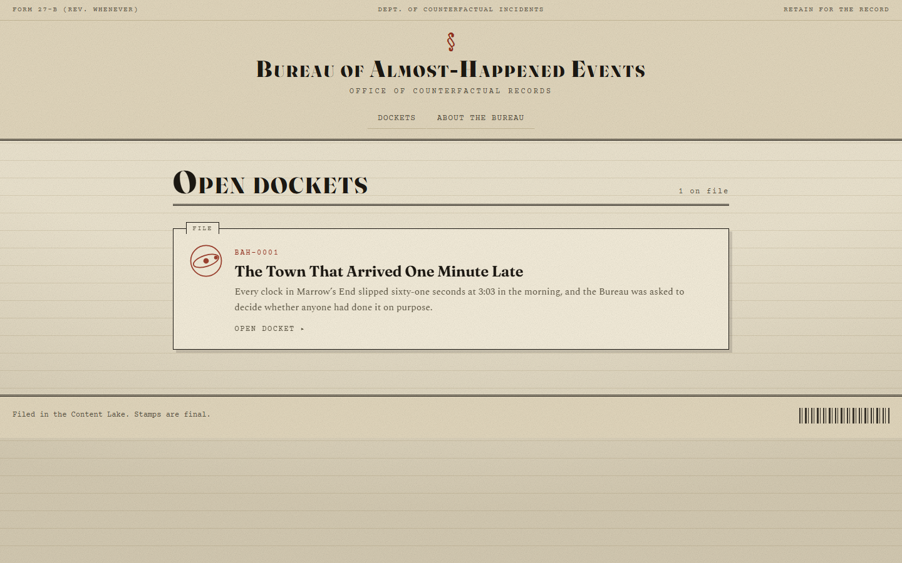
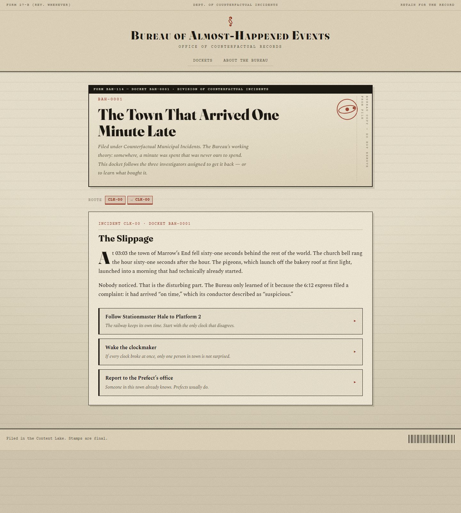
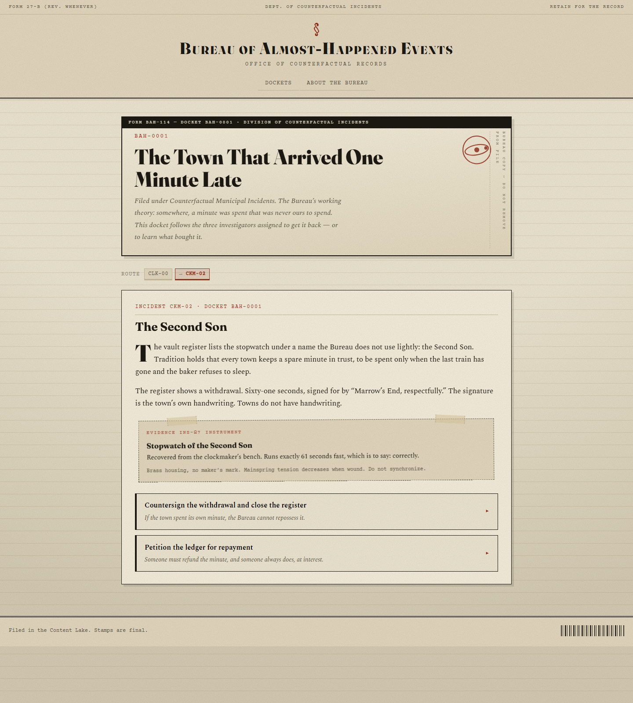
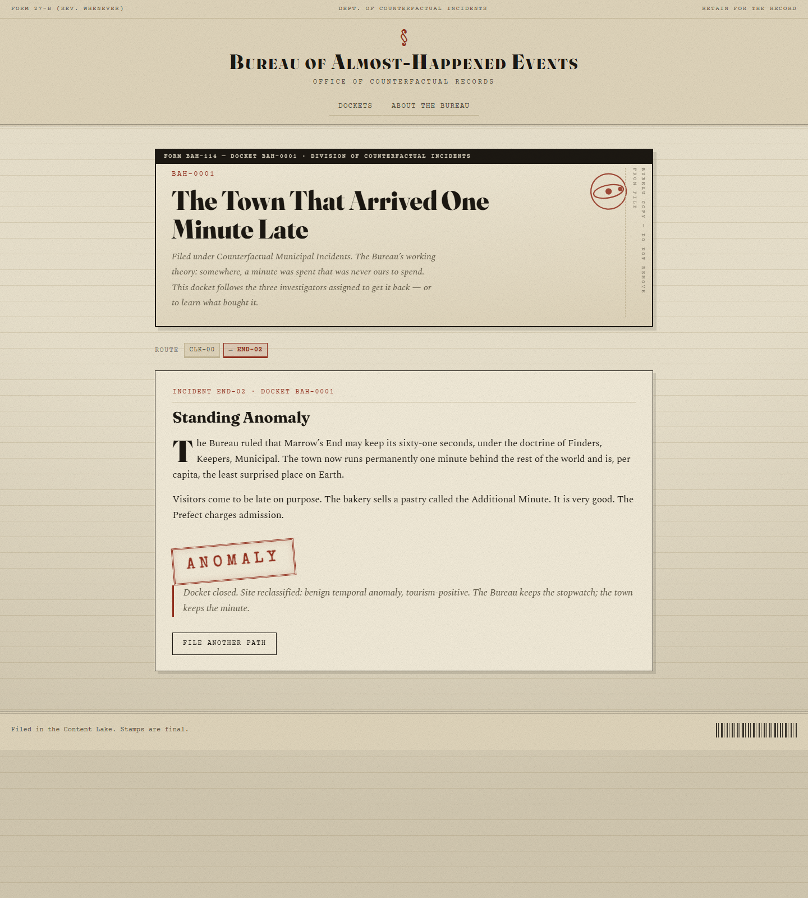
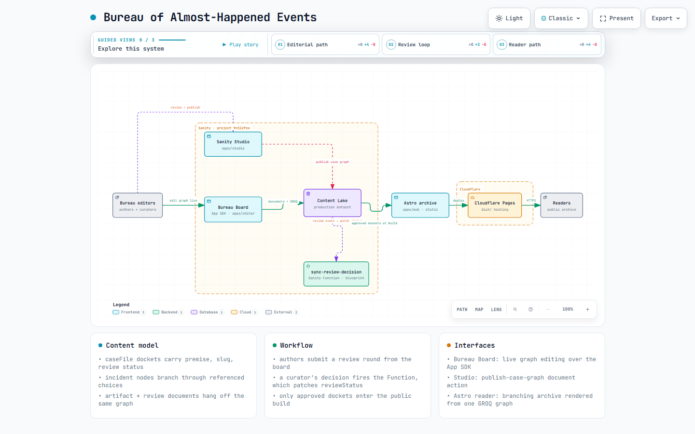

# Bureau of Almost-Happened Events

*A counterfactual story archive where every docket is a branching document graph — and the editors build that graph on a live investigation board instead of a CMS form.*

## Links

| | |
|---|---|
| **Live archive** | https://bureau-events.pages.dev |
| **Repository** | https://github.com/mukeshkbj/bureau-events |
| **Studio** | https://bureau-events.sanity.studio |
| **Bureau Board (App SDK app)** | https://www.sanity.io/@o041d79wc/application/iv082hu12r39wvgimogfoxhc |
| **Sanity project** | `9n512feo` · dataset `production` (public read) |

## What it is

The Bureau files incident reports for events that *almost* happened. A visitor
opens a docket — say, **The Town That Arrived One Minute Late** — and reads the
first incident report. Each report ends in labeled choices; each choice is a
door into another incident. Evidence (stopwatches, memos, photographs) arrives
taped into the reports. Every path terminates in a stamped designation:
**REPRIEVE**, **ANOMALY**, or **CATASTROPHE**. The Bureau does not explain the
difference.

The unusual part is the authoring surface. The archive's stories are stored as
a *graph of documents*, so the editorial tool is a **live investigation board**
— nodes pinned to a desk, edges drawn between them, diagnostics stamped on
broken graphs, all updating in real time over the Sanity App SDK.

## The schema is the product

Four document types, no plumbing:

- **`caseFile`** — a docket: title, slug, premise, filing code (`BAH-####`),
  sigil, and a review status that gates publication.
- **`incident`** — one node in the graph. `order == 0` marks the entry point.
  `choices[]` are objects holding a label, a Bureau-voiced "consequence note",
  and a `next` **reference to a sibling incident**. An incident with no choices
  must declare `ending.isEnding` — enforced by document-level validation.
- **`artifact`** — evidence attached to an incident (`evidence → artifact`),
  rendered in the reader as taped-on registry cards.
- **`review`** — an append-only approval trail. Each round carries the author's
  note, then the curator's decision.

Because the story *is* the reference graph, the public reader is a single GROQ
projection: one query returns the docket plus every incident with its resolved
choices (`choices[]{ "nextId": next._ref }`), ending, and dereferenced
evidence. The frontend walks it as a pure client-side graph traversal with
`#i=<incident-id>` deep links.

## Past the Studio: the Bureau Board (App SDK)

The board is a standalone Sanity app, not a Studio plugin. It shows the same
documents — live — but as the shape an editor actually thinks in:

- A **case rail** listing dockets with their review status pills.
- A **graph canvas**: incidents as pinned cards, SVG edges between choices,
  layered by BFS distance from the entry. Endings, entry points, and flagged
  nodes each get their own look.
- **Live diagnostics** — the same validator the tests run, projected on the
  board: unreachable nodes, choices pointing at missing targets, non-endings
  with no way out.
- **Full authoring**: file a new docket (auto-assigns the next `BAH-####` and a
  slug), add incidents straight onto the board, grow branches with "+ New
  incident linked from here", edit reports/endings in a drawer, attach or
  create artifacts as evidence.
- **Review panel**: submit a round with an author's note; curators approve or
  request changes in place.
- **Activity toasts** for document events — open the board in two windows and
  watch edits land.

Everything the board writes goes through `useCreateDocument` /
`useEditDocument` / `useApplyDocumentActions` — real documents, real
persistence, real-time. The Studio keeps its own job: schema validation plus
two custom document actions, **Submit for review** and **Publish case graph**
(the latter publishes the docket and every child draft in one transaction).

<!-- TODO screenshot: Bureau Board graph canvas (needs Sanity dashboard session — capture from https://www.sanity.io/@o041d79wc/application/iv082hu12r39wvgimogfoxhc) -->
<!-- TODO screenshot: incident drawer editor open on a node -->

## Workflows: review as data, a Function as the messenger

The challenge asked to see a process modeled next to the content. Here it is:

1. An author files a `review` document (`decision: pending`, round number,
   author's note) from the board or Studio.
2. A curator edits that same document — `decision`, `decisionNote`, `reviewer`
   — and publishes it.
3. A **Sanity Function** (`sync-review-decision`, deployed via a Blueprint)
   listens for review events, unions the event payload with the queryable
   reviews so the firing document is authoritative, and patches
   `caseFile.reviewStatus` → `approved` / `changesRequested`.
4. Only `reviewStatus == "approved"` dockets are picked up by the public
   build — the approval literally turns the site on.

Round-tripping works: request changes → author resubmits round N+1 → approved.

<!-- TODO screenshot or short clip: review panel — approve a round, then the status pill flipping (function runs in ~10s) -->

## The build story (the honest part)

A few things broke in instructive ways:

- **Imagined SDK APIs.** First pass of the board was written against the App
  SDK hooks I *assumed* existed (`useQuery` returning pages, separate draft
  saves). The real `@sanity/sdk-react` surface is different — `useDocuments`
  for type queries, `useQuery({query, params})` for GROQ, `useEditDocument`
  with whole-document updaters. The fix was reading the type declarations and
  rewriting five components.
- **Dotted `_id`s are anonymous-invisible.** The seed used IDs like
  `incident.clk-00`. The dataset was public, authenticated queries worked — but
  anonymous reads returned `omitted: permission`. Only a raw `curl` revealed
  that `.` in an `_id` namespaces the document away from public access.
  Everything was re-seeded with hyphenated IDs.
- **A Function race that looked like a no-op.** The Function queried "latest
  review" after receiving the event — but the event can fire before the new
  document is visible to the query index. Round 3 silently computed against
  stale data and the idempotency check skipped the patch *permanently*. The fix
  folds `event.data` into the decision set so the firing document is always
  authoritative. Logs confirmed the patch landing on round 4.
- **Layering a cyclic graph.** The first `computeLayers` used longest-path
  relaxation — which diverges on cycles. Replaced with shortest-path BFS.

## Stack

Astro 7 (static) · Sanity Studio v6 · App SDK (React 19) · Sanity Functions +
Blueprints · Cloudflare Pages · pnpm monorepo with a shared
`@bureau/content-model` package (schemas, GROQ, graph validator + tests, seed).

## Try it

- Read the archive: https://bureau-events.pages.dev — take a path to an ending.
- Open the Studio (invite required) or the Board app link above.
- Repo README has setup, seeding (token or CLI-session import), deploy steps,
  and the docket-authoring walkthrough.

Demo walkthrough — index → dossier → choices → evidence → ending (62s, `docs/media/archive-walkthrough.webm`; upload to DEV as a video embed):

https://github.com/mukeshkbj/bureau-events/blob/master/docs/media/archive-walkthrough.webm

<!-- OPTIONAL second clip if you want the editorial side too: file a docket → add incidents → submit review → approve → status flips (needs a logged-in Sanity session — capture on your screen, e.g. Win+Alt+R) -->
